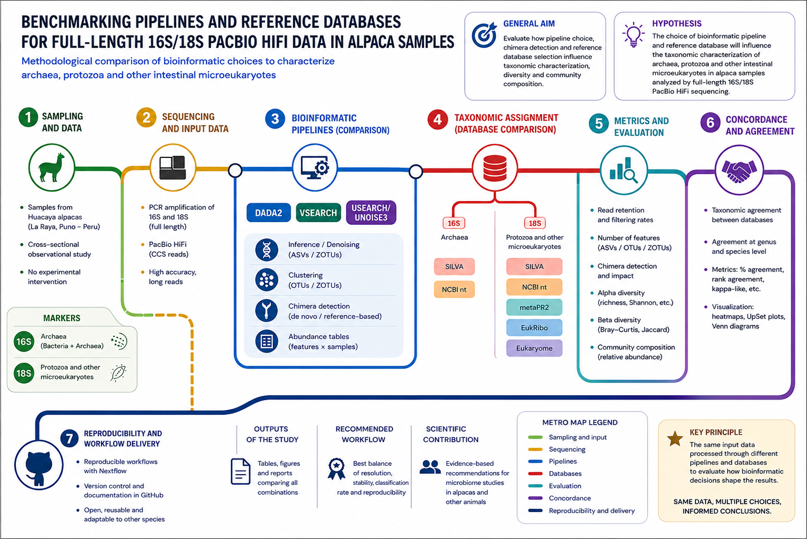
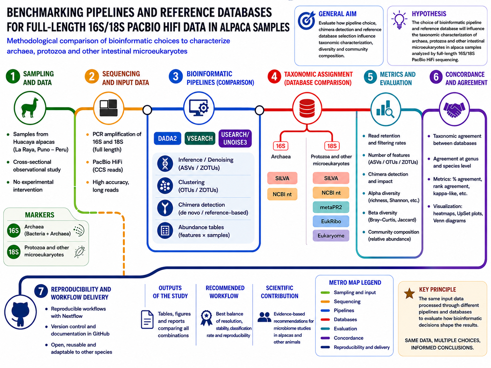
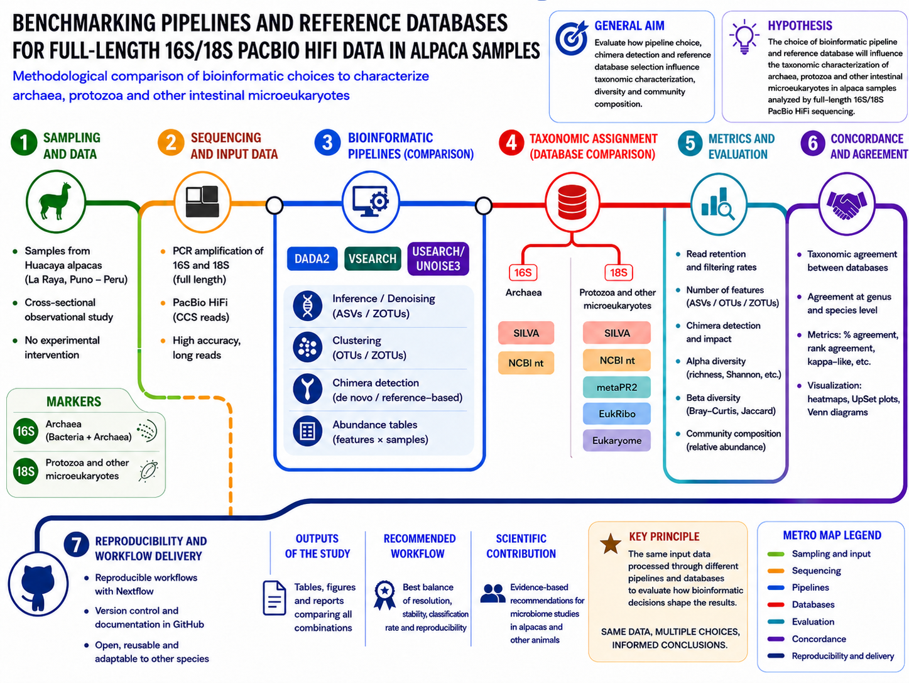
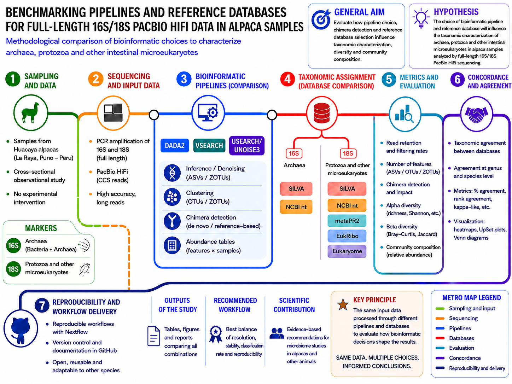
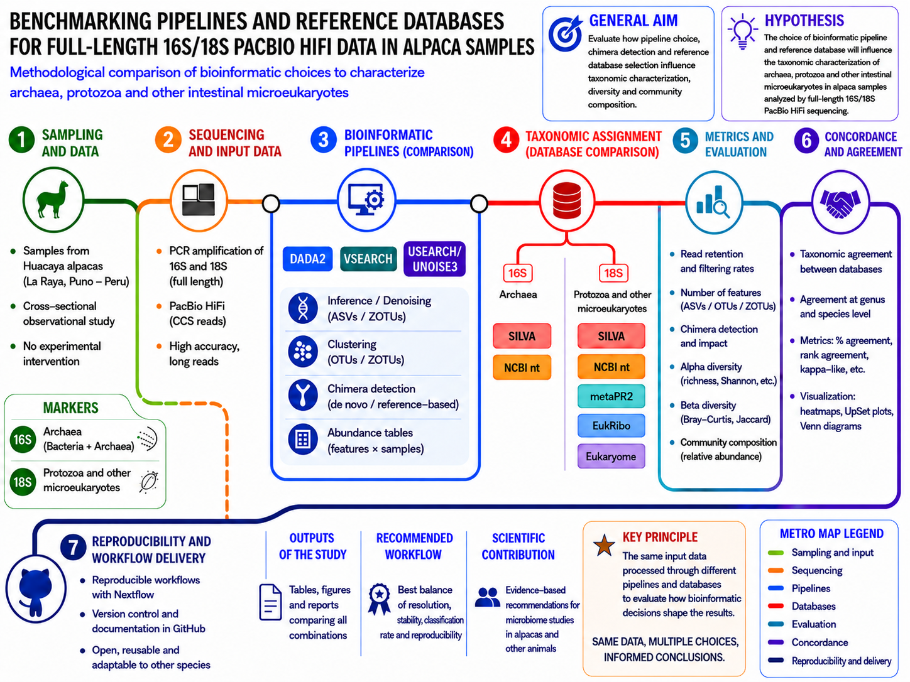

# Alpaca Microbiome 16S/18S HiFi Pipelines


## Workflow



## Workflow



## Workflow



## Workflow



## Workflow



## Execution methods

QC-only:
```bash
nextflow run main.nf --mode qc_only -profile local -resume
```

Benchmarking:
```bash
nextflow run main.nf --mode benchmarking -profile local -resume
```

Recommended:
```bash
nextflow run main.nf --mode recommended -profile local -resume
```

## Notas
- El modo `qc_only` genera estadísticas pre/post-trim y un reporte HTML.
- `-resume` reutiliza tareas completadas si no cambian entradas/parámetros.
